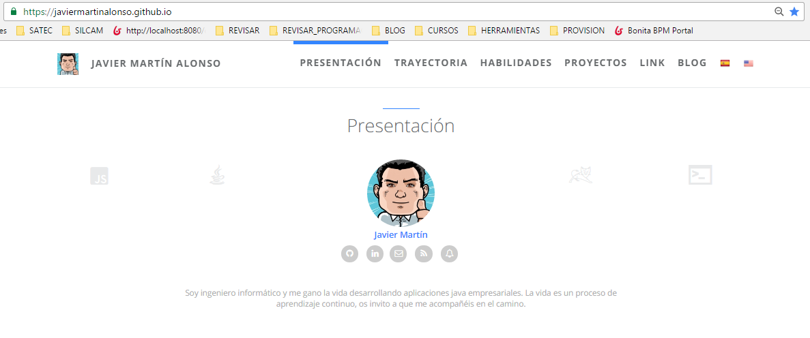

# Página personal y Blog de Javier Martín Alonso

[Javier Martín Alonso](https://javiermartinalonso.github.io/ "Página personal y Blog de Javier Martín Alonso")

Esta es mi página web personal y contiene entre otras cosas mi blog. 

Diseñado como un tema de Jekyll de aspecto simple, diáfano y veloz.

Responsivo: pensado para poder ser visualizado de forma fluida en cualquier dispositivo.

Los menus y las páginas son multilingües excepto el contenido de los artículos.

Estaré encantado si quieren ponerse en contacto conmigo para darme algún consejo o comentar algo sobre mi página web.

## Tecnologías empleadas

* [Jekyll](http://jekyllrb.com)
* [Bootstrap](http://www.bootcss.com)
* [jPages](http://luis-almeida.github.io/jPages)
* [i18next](http://i18next.github.io/i18next)

## ¿Cómo contribuir?

1. Haz fork del repositorio
2. Crea tu propio branch (`git checkout -b my-new-feature`)
3. Haz Commit de tus cambios (`git commit -am 'Add some feature'`)
4. Realiza un Push al branch (`git push origin my-new-feature`)
5. Crea new Pull Request